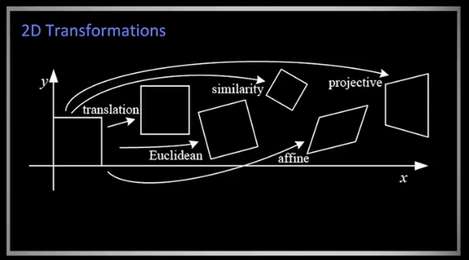

# Computer Vision

## Introduction to CV
[Course on Udacity 810](https://classroom.udacity.com/courses/ud810) by Aaron Bobick. The problem sets can be found in the [ CS4495 Spring 2015](https://www.cc.gatech.edu/~afb/classes/CS4495-Spring2015-OMS/) from Georgia Tech.
* [ ] I have created a Github repo for the problem sets. I have only done the first problem set. Revisit sometime later.
* [Smoothing and Blurring](https://classroom.udacity.com/courses/ud810/lessons/3490398569/concepts/35009385470923)
  * To blur an image, we can compute convolution of a Gaussian function with the original image.
  * Since the Fourier Transform of a convolution is actually the multiplication of individual Fourier Transform, a fat Gaussian that is supposed to blur the image heavily has a Fourier Transform that almost only contains the low-frequency part.
  * g(x) = f(x) * h(x)  => G(u) = F(u)H(u). Here, * means convolution.
  * In other words, these two concepts are connected in this way. Fourier Transform explains what happened in the frequency domain while doing convolution.
* [Projective transformations](https://classroom.udacity.com/courses/ud810/lessons/3011388777/concepts/30117587440923). Lines remain lines.
  * 
  * Translation: [[1, 0, tx], [0, 1, ty], [0, 0, 1]],  2 degree of freedom (DoF)
  * Euclidean (Rigid body):  translation + rotation. [[cosθ, -sinθ, tx], [sinθ, cosθ, ty], [0, 0, 1]], 3 DoF
  * Similarity transform:translation + rotate + scale. [[acosθ, -asinθ, tx], [asinθ, acosθ, ty], [0, 0, 1]], 4 DoF. Scale factor: a.
  * Affine transform: translate + rotate + scale + skew. [[a, b, c], [d, e, f], [0, 0, 1]], 6 DoF. Preserves parallel lines, ratio of areas, lines.
  * General projective transform (or Homography, 单应性): [[a, b, c], [d, e, f], [g, h, i]]. Lines near you may seem longer than lines far away. It seems that 9 DoF. However, since we are using homogenous coordinates, we will divide the `w` anyway. So, we can simplify the matrix as [[a, b, c], [d, e, f], [g, h, 1]], which has 8 DoF. Note that the last DoF is 1, instead of i.
* [Essential Matrix](https://classroom.udacity.com/courses/ud810/lessons/3066558680/concepts/30714287020923)
  * For two calibrated cameras, suppose we know the translation (T) and rotation (R) to transform the camera center to another, also we know two points on each image plane (X and X'), then we have: transpose(X')EX = 0. Here, E = [Tx]R = T x R, which is called *essential matrix*. Note that the cross product is written as a matrix multiplication, denoted as [Tx]. This is because a x b = [[0, -a3, a2], [a3, 0, -a1], [-a2, a1, 0]][b1,b2,b3] = [ax]b.
  * Side note: If we see something in the form of inverse(A)MA, it normally means we are translating a coordinate in a different coordinate system. See this video as well: [线性代数的本质 - 09 - 基变换](https://www.bilibili.com/video/BV1Ls411b7r2/?spm_id_from=333.788.recommend_more_video.-1)
* [Fundamental Matrix](https://classroom.udacity.com/courses/ud810/lessons/3093918667/concepts/30748886490923), for uncalibrated cameras.
  * transpose(P)FP' = 0, in which F is the fundamental matrix and P/P' are the points in two frames.
* Feature points
  * [Harris corners](https://classroom.udacity.com/courses/ud810/lessons/3168178614/concepts/31712686140923)
    * Second-order Taylor expansion.
    * Second moment matrix (M). Compute the derivative around each pixel within a small patch.
    * Detect corners. It could be solving the eigenvalues of the matrix above (λ1 and λ2). If both are large, then the pixel is a corner. If only one is large, then it is an edge. However, solving the eigenvalues is expensive. There is an approximation function: [Harris Corner Response Function](https://classroom.udacity.com/courses/ud810/lessons/3168178614/concepts/31712686170923).
    * R = det(M) - α * trace(M)^2 = λ1λ2 - α(λ1+λ2)^2, in which α is a constant (0.04 to 0.06)
    * R is large for a corner.
  * [Scale invariant](https://classroom.udacity.com/courses/ud810/lessons/3171708614/concepts/31807086020923)
    * When an image is scaled, an initial corner may seem like an edge given the original window size.
    * We need to try different scale factor.
    * The goal is to find a good function that can tell us which scale is the right one.
    * We use Laplacian of Gaussian in which the value will be maximum around a proper scale, while it will be small for small or large scale.
    * A trick: compute Difference of Gaussian (DoG), which is much faster than Laplacian of Gaussian. DoG = G(x, y, kσ) - G(x, y, σ)
  * SIFT descriptors to describe a feature point distinctively and robust.
    * Main idea: find orientation and build description based on the orientation.
    * Pick a small region around the feature point (x, y) at selected scale. (Note, the scale is determined earlier.)
    * To find the orientation: create histogram of local gradient directions in 36 bins.  Pick the dominant direction as the orientation. This orientation becomes the north of the region.
    * Normalization: rotate the region to standard orientation; scale the region based on the scale at which the feature was found.
    * The above process ensures that the descriptor is invariant to x, y, scale, and orientation.
    * Consider the region around the feature point, say 8x8 pixels.
    * Compute the gradient for each pixel, weighted by Gaussian. The pixel near the center has bigger weight.
    * Pick a smaller window (e.g., 4x4) and compute a histogram in 8 bins (angles).
    * We can slide the window around the entire region. (The slide process is similar to what we did in Convolution). For example, we can get 4x4 windows, namely, 4x4 histograms.
    * Concat all values into a long vector (e.g., 4x4x8 = 128 values)
  * RANSAC. RANdom SAmple Consensus for feature point matching.
    * Propose a model.
    * Randomly pick some points to fit a model.
    * Count how many points after applying the computed model (transform) are "inliers" and "outliers".
    * Repeat until we find a good model.
    * The key idea is that the number of times to repeat is not very big, if we pick less than 10 points as a sample. 10 points are enough for Homography (4 points) and fundamental matrix (8 points).

## Feature tracking and plane detection
* [ ] [Good features to track (1993)](https://users.cs.duke.edu/~tomasi/papers/shi/TR_93-1399_Cornell.pdf)
* [ ] [SIFT (Scale Invariant Feature Transform)](https://link.springer.com/article/10.1023/B:VISI.0000029664.99615.94) 2004 by David G. Lowe.
* [ ] [SURF (Speeded Up Robust Features)](https://link.springer.com/chapter/10.1007/11744023_32) 2006 by H. Bay et al.
* [ ] [BRISK (Binary Robust Invariant Scalable Keypoints)](https://www.research-collection.ethz.ch/bitstream/handle/20.500.11850/43288/eth-7684-01.pdf?sequence=1) 2011. It can provide better overall performance than SIFT and SURF. It is often based on [FAST algorithm (2006)](https://link.springer.com/chapter/10.1007/11744023_34) by Rosten and Drummond.
  * FAST uses the circular surroundings of each pixel `p` (e.g., 16 pixels in a circle around `p`) to detect a corner. If a certain number of connected pixels are brighter or darker than the central pixel `p`, then the algorithm found a corner.
  * In BRISK, at least 9 consecutive pixels in the 16-pixel circle must be sufficiently brighter or darker than the central pixel `p`. In addition, BRISK also uses down-sized images (scale-space pyramid) to achieve better invariance to scale.
  * *Keypoints*: the algorithm must find the feature again in a different image (with different perspective, lightning, etc). BRISK descriptor is a binary string with 512 bits, which is a concatenation of brightness comparison results between different samples surrouding the center keypoint.
* A blog post: [Basics of AR: Anchors, Keypoints & Feature Detection (Aug 2018)](https://www.andreasjakl.com/basics-of-ar-anchors-keypoints-feature-detection/) describes a little more about BRISK.
  * It also includes code of Python + OpenCV to visualize the feature points in an image.

## Optical flow
* [光流法(optical flow)简介](https://blog.csdn.net/qq_41368247/article/details/82562165)
  * 约束方程只有一个，而方程的未知量有两个。
  * 有不同种类的求解方法
    * 基于梯度（微分）的方法：Horn-Schunck算法与Lucas-Kanade(LK)算法；
    * 基于匹配的方法、
    * 基于能量（频率）的方法、
    * 基于相位的方法
    * 神经动力学方法。
* 基本假设
  * 亮度恒定不变。即同一目标在不同帧间运动时，其亮度不会发生改变。这是基本光流法的假定（所有光流法变种都必须满足），用于得到光流法基本方程；
  * 时间连续或运动是“小运动”。即时间的变化不会引起目标位置的剧烈变化，相邻帧之间位移要比较小。同样也是光流法不可或缺的假定。
* [Lucas-Kanade 算法公式推导](http://image.sciencenet.cn/olddata/kexue.com.cn/upload/blog/file/2010/9/2010929122517964628.pdf)
  * LK光流法在原先的光流法两个基本假设的基础上，增加了一个“空间一致”的假设，即所有的相邻像素有相似的行动。也即在目标像素周围m×m的区域内，每个像素均拥有相同的光流矢量。这个条件使得约束方程可以解。
  * 这里考虑的是仿射变换
  * 梯度下降求模板与采样的最小误差
  * [最小二乘法](https://www.cnblogs.com/AndyJee/p/5053354.html) 和[（伪逆矩阵，左逆）](https://www.cnblogs.com/AndyJee/p/5082508.html)
  * 副产品是Hessian 矩阵
* Lucas-Kanade 算法公式在物体运动快的情况下，“空间一致”的假设不成立。上面[光流法(optical flow)简介](https://blog.csdn.net/qq_41368247/article/details/82562165)里提到一种**金字塔LK光流法**。
  * 基本想法是缩小图像的尺寸，让大范围的运动变成了小范围的，强行满足“小运动”的假设。
  * 每一帧建立一个高斯金字塔，最低分辨率图像在最顶层,原始图片在底层。
  * 顶层的光流计算结果(位移情况)反馈到第Lm-1层

## 相机标定
* [相机标定究竟在标定什么？(2017)](https://zhuanlan.zhihu.com/p/30813733)
  * 通常我们用相机把三维物体变成二维的图片，这个过程是不可逆的。相机标定的目的是找到一个相机的近似模型，既可以把三维物体变成二维图片，也可以求出反函数，用来重建三维物体。
  * 最粗糙的近似是把相机近似成小孔成像模型。利用相似三角形和成像原理，可以得到物点在相机坐标系里的坐标与像点在CCD坐标系上的坐标的关系，一个矩阵变换。
  * 如果考虑相机畸变，还要添加畸变参数。
  * 使用标定板（例如棋盘格和圆点阵列），在不同的角度下采样，加上最小二乘法等等方法，可以求出这个模型的参数。标定板有两个作用，一是方便得出物点和像点之间的一一对应关系，毕竟虽然成像发生了畸变，但相对的拓扑结构没变，比如棋盘的直角在成像后也能找到对应的交叉点。二是标定板的物理尺寸已知，可以得到物点在相机坐标系下的坐标。这要求标定板的平面很平，而且网格的尺寸要一致。
* [张正友标定法](https://zhuanlan.zhihu.com/p/24651968)
  * 更加深入的聊了一下怎么求解参数。
  * 在附录里解释了为什么使用“齐次坐标”
    * 在笛卡尔坐标系里无法表达两个平行线的相交，但人眼因为透视的现象，会看到物体“近大远小”。可以用齐次坐标来表达。
    * 同时，齐次坐标可以用来更容易地表达仿射变换里的平移，也就是引入多一维的矩阵。记得当时在阿里面试的时候也问到这个问题，不过没有联想到这里。
    * 齐次坐标可以用来区分向量和点。也就是在表达成矩阵形式的时候，最后一个值如果是0，那就是向量；如果是1，就是点。
* [另一篇文章](https://blog.csdn.net/a083614/article/details/78579163)，包含了 matlab 和 opencv 的例子 
* 视频：[相机标定之带你推张正友标定方法](https://www.bilibili.com/video/av79367094/)