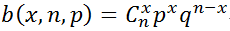

## 概率分布
* [伯努利分布](https://zhuanlan.zhihu.com/p/24692791)。
  * 在一次伯努利试验中，事件A出现的概率为p，不出现的概率为q=1-p。问一次试验出现事件的分布是什么。这是最简单的分布。
  * 
* [二项分布(Binomial Distribution)](https://zhuanlan.zhihu.com/p/24692791)
  * 指在只有两个结果的n次独立的伯努利试验中，所期望的结果出现次数为x的概率。
  *  
  * 伯努利分布是二项分布在n = 1时的特殊情况。
  * 当试验的次数趋于无穷大，而乘积np固定时，二项分布收敛于泊松分布。
  * 需要特别提醒的是：二项分布是建立在**有放回抽样**的基础上的。在实际的工作中通常我们很少会这样抽，一般都属于**无放回抽样**，这时候需要用超几何分布来计算概率。当总数很大而取样数相对很少时，可以近似为有放回抽样。
* 几何分布
  * 有两种分布，不应该混淆：
    * 在伯努利试验中，得到一次成功所需要的试验次数X。X的值域是{ 1, 2, 3, ... }
    * 在得到第一次成功之前所经历的失败次数Y = X − 1。Y的值域是{ 0, 1, 2, 3, ... }
  * 比如，假设不停地掷骰子，直到得到1。投掷次数是随机分布的，取值范围是无穷集合{ 1, 2, 3, ... }，并且是一个p = 1/6的几何分布。
* Beta分布，见[这篇](https://www.zhihu.com/question/30269898)和[这篇](https://www.zhihu.com/question/30269898/answer/123261564)
  * 概率的概率分布。当你不知道一个东西的具体概率是多少时，它可以给出了所有概率出现的可能性大小。
  * 可以做非常好的先验分布。
  * 用Beta分布来模拟扔硬币的先验分布之后，通过贝叶斯推断，得到的后验分布依然是Beta分布。这就被称为共轭(conjugate)。每当我们多抛一次硬币，就可以很容易的更新这个Beta分布。

* [泊松分布](https://en.wikipedia.org/wiki/Poisson_distribution)
  * 离散概率分布
  * 适用于描述单位时间内随机事件发生的次数的概率分布。如某一服务设施在一定时间内受到的服务请求的次数，电话交换机接到呼叫的次数、汽车站台的候客人数、机器出现的故障数、自然灾害发生的次数、DNA序列的变异数、放射性原子核的衰变数、激光的光子数分布等等。
  * 期望和方差都是 λ
  * 
  * 极大似然估计（MLE），见下面。
* 概率密度函数（probability density function， PDF）
  * 区间的积分，也就是面积，表示概率
  * [视频：为什么"概率为0"不等同"不可能"](https://www.bilibili.com/video/BV1ga4y147sC)

## 极大似然估计（最大似然估计）
* [维基百科](https://zh.wikipedia.org/wiki/%E6%9C%80%E5%A4%A7%E4%BC%BC%E7%84%B6%E4%BC%B0%E8%AE%A1)。L(θ|x1,...,xn) = fθ(x1,...,xn)。对于n个采样x1,...,xn，fθ则为X1，X2,...,Xn联合分布的概率密度函数在观测值处的取值，称为似然函数。对于每个可能的θ，fθ都能得到一个值，目的是在所有可能的θ的取值中找到一个θ使得fθ取到最大值。这个使可能性最大的θ即称为最大似然估计。 里面举了三个例子
  * 离散分布，离散有限参数空间。
  * 离散分布，连续参数空间。
  * 连续分布，连续参数空间。
* [似然性(likelihood)](https://zh.wikipedia.org/wiki/%E4%BC%BC%E7%84%B6%E5%87%BD%E6%95%B0) 和概率 (probability) 意思相近，但不一样。似然性，用于在已知某些观测结果时，对参数进行估计；概率，用于在已知一些参数的情况下，预测接下来的观测结果。在这种意义上，似然函数可以理解为条件概率的逆反。
* [极大似然估计和EM算法](https://zhuanlan.zhihu.com/p/36331115)。这篇文章在[EM.md](./EM.md)里总结过。

## EM算法（期望最大化算法）
见我总结的 [EM算法](./EM.md)

## 高斯混合模型（GMM）
* [scikit-learn里的高斯混合](https://scikit-learn.org/stable/modules/mixture.html)。
  * 底层实现了EM算法。
  * Gaussian Mixture需要提供 component 的个数，优点是速度最快的。

* 当不提供component个数时，可以用 Variational Bayesian Gaussian Mixture
  * 底层算法依然是EM算法，但基于之前的分布信息来添加正则化。
  * 最重要的参数是`weight_concentration_prior`。当取值小的时候，模型会把大部分权重放在少量的component上；而当取值大的时候，允许更多的component。

* 狄利克雷过程(Dirichlet Process），见[这篇](https://www.zhihu.com/question/26751755)。为了更容易理解 Dirichlet Process，可以用Beta分布和Bernoulli分布来引入。
  * Bernoulli process：重复的独立Bernoulli trials （抛硬币）。假设抛出正面的概率是q。那么抛n次，得到了某个结果（比如k次正面朝上），问q是多少。很显然，因为n是有限的，我们不可能得到一个准确的q值，而只能猜q大致分布在[0,1]中间的哪些值比较合理。所以需要一个工具来描述q的可能的分布。可以写成条件概率密度。
  * Beta distribution。引入贝叶斯理论，经过一些转换，可以发现，上面的条件概率密度正比于一个beta分布。
  * 用Beta分布来模拟扔硬币的先验分布之后，通过贝叶斯推断，得到的后验分布依然是Beta分布。这就被称为共轭(conjugate)。每当我们多抛一次硬币，就可以很容易的更新这个Beta分布。更多Beta分布的内容见[这篇](https://www.zhihu.com/question/30269898)。
  * 如果每次trial的结果不是2种，而是k个可能的结果（比如掷骰子），那么Bernoulli trial就要变成一次trial有k个可能的结果； Bernoulli distribution就变成multinomial distribution。而beta distribution所表述的先验分布，也要改写成一个多结果版本的先验分布。那就是 Dirichlet distribution。

## 联合概率，条件概率，边缘概率
* [联合概率、边缘概率、条件概率](https://zhuanlan.zhihu.com/p/53005534)
  * 举了一个扑克牌的例子。
* [联合概率、边缘概率、条件概率之间的关系&贝叶斯公式](https://blog.csdn.net/tick_tock97/article/details/79885868)
  * 使用面积作为例子。
  * 条件联合分布的分解 P(X = a, Y = b|Z = c) = P(X = a|Y = b, Z = c)P(Y = b|Z = c)
  * 最后的宝箱陷阱的例子，讲解了贝叶斯公式。我发现我基本不了解贝叶斯公式，只知道最基本的形式，不知道怎么利用起来解这个最简单的例子。
  * "打到怪物就能获得宝箱，但是宝箱有2/3的概率是陷阱，玩家可以通过魔法来检查，但是有1/4的误判概率，问：假设玩家利用魔法判定此宝箱没有陷阱，求宝箱有陷阱的概率"
    * P(有陷阱) = 2/3
    * P(没有发现|有陷阱) = 1/4 误判
    * P(发现了|没有陷阱) = 1/4 误判
    * 求P(有陷阱|没有发现)
    * P(有陷阱|没有发现) = P(有陷阱，没有发现) | P(没有发现)
    * 而 P(没有发现) = P(有陷阱，没有发现) + P(没有陷阱，没有发现) = P(没有发现|有陷阱) * P(有陷阱) + P(没有发现|没有陷阱) * P(没有陷阱) = (1/4) * (2/3) + (3/4) * 1/3 = 5/12
    * P(有陷阱，没有发现) = P(没有发现|有陷阱) * P(有陷阱) = 1/6
    * 所以最终结果是 2/5

## Fisher's Exact Test
* Example: [The lady tasting tea experiment](https://brainder.org/2015/08/23/the-lady-tasting-tea-and-fishers-exact-test/).
* Use Fisher's Exact test when one of the expected values (note: not the observed values) in a 2 × 2 contingency table is less than 5, and especially when it is less than 1. This is the case when Chi-square test is not recommended (although Yates’ correction can improve the accuracy).
* Original paper: *The logic of Inductive Inference by Fisher in 1935*.
  * Interestingly, the paper includes the comments from several professors in the conference.

## 其他
* [视频：医检阳性≠得了病？重新理解贝叶斯定理](https://www.bilibili.com/video/BV1Ei4y1F72M)
  * 例子，人群中患某种癌症的概率是1%（先验概率），某种测试的 Sensitivity是90%，即在真患病的人中，90%的概率结果为阳性，也有10%为假阴性。同时，这种测试的 Specificity为91%，即在没有患病的人中，91%的测试结果为阴性，而9%为假阳性。
  * 如果一个人的检测结果是阳性，其实真正患病的概率只有大约 1/11。即 TP / (TP + FP) 。TP是True Positive的人数， FP为False Positive的人数，不是False Positive Rate。1000个人中，9个为TP，990 * 9% = 89 为FP。
  * 视频提供了一个很简便的计算真实患病概率的公式，用odds ratio 乘以 “贝叶斯因子”。
  * 贝叶斯因子 = Sensitivity / False Positive Rate = Sensitivity / (1 - Specificity)，表示了每次测试**更新**了先验的程度。
  * 把先验概率表达成odds，即1%表达成 1：99；计算贝叶斯因子 90% / 9% = 10；相乘，得到 10 : 99，如果转换回概率，就是 10 / 109 约等于 1/11