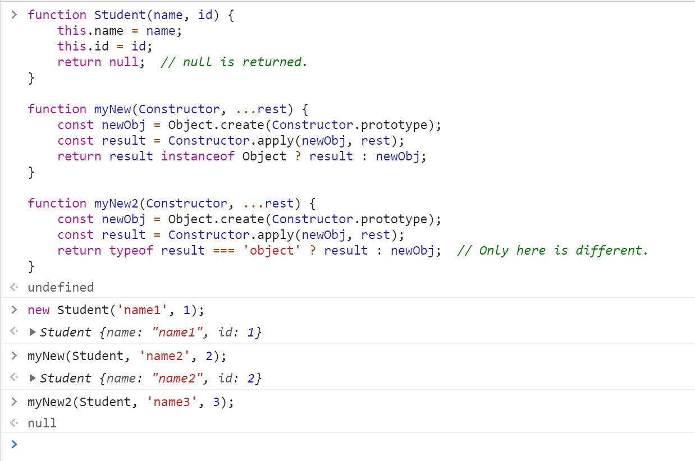
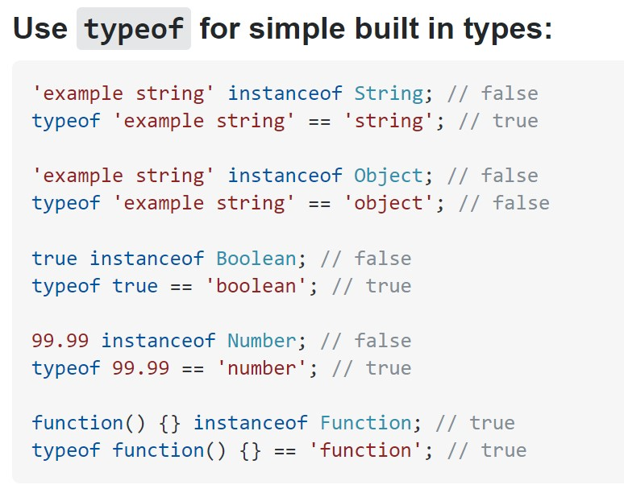

# JavaScript手写new, call, apply, bind

- [JavaScript手写new, call, apply, bind](#javascript手写new-call-apply-bind)
  - [实现自己的`new`](#实现自己的new)
  - [实现自己的`bind`](#实现自己的bind)
  - [实现自己的`call`和`apply`](#实现自己的call和apply)
  - [扩展](#扩展)
    - [typeof vs instanceof](#typeof-vs-instanceof)
    - [new与bind的优先级](#new与bind的优先级)

## 实现自己的`new`

```js
function Student(name, id) {
    this.name = name;
    this.id = id;
}
Student.prototype.sayHello = () => { console.log('hello'); }

// ES6
function myNew(Constructor, ...rest) {
    const newObj = Object.create(Constructor.prototype);
    const result = Constructor.apply(newObj, rest);
    return result instanceof Object ? result : newObj;
}

// ES5
function myNew() {
    var newObj = {};
    var Constructor = Array.prototype.shift.call(arguments);
    newObj.__proto__ = Constructor.prototype;
    var result = Constructor.apply(newObj, arguments);
    return result instanceof Object ? result : newObj;
}

// Usage
const student1 = myNew(Student, 'Tom', 1);
```
注意，`myNew`的最后一行不能使用`typeof result === 'object'`，因为如果返回值是`null`，那么`typeof null === 'object'`为true，就会导致myNew返回null。而浏览器里原生的new是会返回newObj的。对比见下图：



其中，`myNew2`返回了null，跟原生的`new`结果不同。具体对比`typeof`和`instanceof`见本文的扩展部分。


## 实现自己的`bind`
最简单版本：
```js
Function.prototype.myBind = function(context, ...args) {
    if (!(this instanceof Function)) {
        throw new Error('Must bind to a function');
    }
    return (...newArgs) => {
        return this.apply(context, [...args, ...newArgs]);
    }
}
```
注意，`myBind`不能是箭头函数，否则内部的this会是创建时候的this，而不是调用myBind时候的this。return的function可以用箭头函数，这样就不用额外保存外部的this为fn了。

但是，如果想要支持new，就还是用传统的function。因为箭头函数既没有prototype，也不能调用call、apply、bind，这样就没办法在new的时候用新的obj来替换scope。（见如何实现自己的new时调用了`Constructor.apply`。）
```js
Function.prototype.myBind = function(asThis, ...args) {
    const fn = this;
    if (!(fn instanceof Function)) {
        throw new Error('Must bind to a function');
    }
    function resultFn(...newArgs) {
        return fn.apply(
            resultFn.prototype.isPrototypeOf(this) ? this : asThis,  // 用来绑定this
            [...args, ...newArgs]
        )
    }
    resultFn.prototype = fn.prototype;
    return resultFn;
}
```

## 实现自己的`call`和`apply`


## 扩展

### typeof vs instanceof
见这个Stack Overflow问题：[typeof vs. instanceof](https://stackoverflow.com/questions/899574/what-is-the-difference-between-typeof-and-instanceof-and-when-should-one-be-used)。
简单来说：只有在判断简单的built-in types（string，boolean，number) 的时候，使用typeof，而不用instanceof + 大写的构造函数。其他时候都可以使用instanceof。



其实还有三个办法可以判断类型，一个是用来判断子类与父类的关系：`Foo.prototype.constructor === Base` 以及 `Object.prototype.toString.call([1]) === '[object Array]'`。前者因为constructor可能会被不小心修改或者忘记修改，那么判断会出错。后者通常用来判断是不是Array，但已经有了`Array.isArray`，用处也没有那么大。
另外，Function.prototype.isPrototypeOf.

### new与bind的优先级
在上面bind的代码中，一个bind后的function也能new，但问题就是这个new的时候的this是什么。

通过bind的代码看出，new绑定this的优先级大于bind，所以函数内部在new的时候与bind传入的context无关。下面代码来自[美团笔试题第二题](https://juejin.im/post/6845166890990436359)，就考察了这个点：

```js
var name = 'global';
var obj = {
    name: 'local',
    foo: function() {
        this.name = 'foo';
    }.bind(window)
};
var bar = new obj.foo();
console.log(bar.name);  // ==> 'foo'
console.log(name);  // ==> 'global'
```
